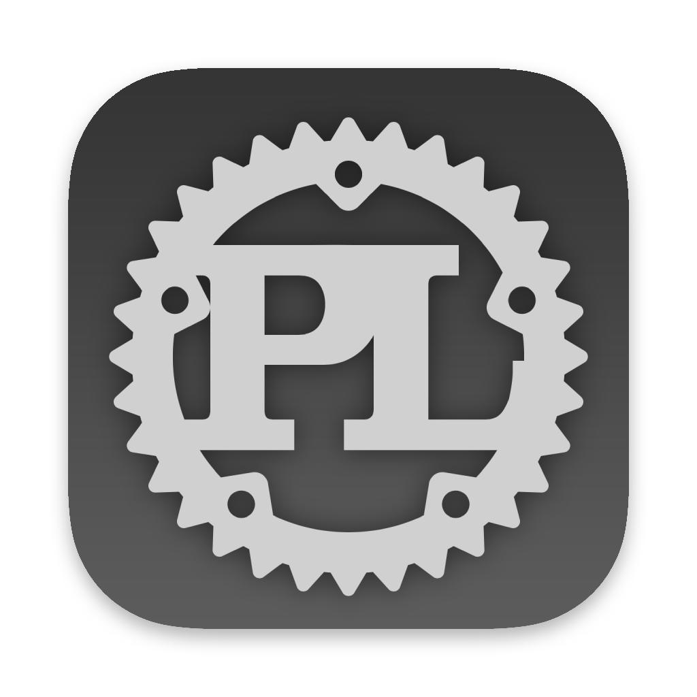

# PlistOxide 

Cross-platform Property List (plist) editor written in Rust.

The Source Code of this Original Work is licensed under the `Thou Shalt Not Profit License version 1.5`. See [`LICENSE`](LICENSE).
